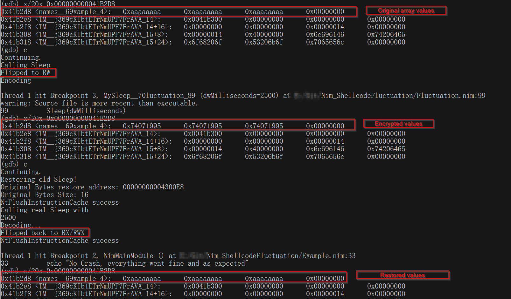

# NimShellcodeFluctuation

Nim Port of the original repo:  https://github.com/mgeeky/ShellcodeFluctuation
All comments were copy pasted as they were from the original Repository as they really helped me to understand the technique. For more information about the technique itself I highly recommend going through the README of the original Repo!

Install dependencies:
```
nimble install winim ptr_math
```

I'm fully aware of the fact, that this memory encryption technique is not the best in terms of OpSec. It will only encrypt exactly those regions, which were defined for it. So for e.g. a C2-Implant, all newly executed module memory addresses won't be encrypted on Sleep. For Heap-Based detections (such as those for the Cobalt-Strike config) you would still need to add Heap encryption here.

But still, the memory encryption technique can be used perfectly fine to avoid automatic memory scanner detections on Sleep `for the main` C2-Implant. I did test the PoC successfully with Covenant and a customized stageless Payload [like this](https://gist.github.com/S3cur3Th1sSh1t/60427d2e517e295e845bc684391bfa62).

The Encryption/Decryption Key plus the Shellcode address and more values like the protection (RW) have to be defined manually in this Port. In the original Repo the Shellcode Caller-Adress was automagically retrieved.

The `Example.nim` file contains everything you need to get started. Of course when using C2-Shellcode you don't need to call `Sleep` by yourself (this is just to trigger everything for the PoC), that should be done by your C2 itself. For the moment this is only compatible with C2-Frameworks that use the Win32 Sleep function but if you modify the Hook for another function it will work the same way.

```nim

import winim
import Fluctuation

echo "Trying to hook Sleep"

if (hookSleep()):
    echo "Hooked Sleep successfully!"
    
    type
      PocArray = array[12, byte]
    let names: PocArray = [byte 0xAA,0xAA,0xAA,0xAA,0xAA,0xAA,0xAA,0xAA,0xAA,0xAA,0xAA,0xAA]
    g_fluctuationData.shellcodeAddr = unsafeAddr names[0]
    echo "Shellcode address:"
    echo repr(g_fluctuationData.shellcodeAddr)
    g_fluctuationData.shellcodeSize = size_t(len(names))
    echo "Shellcode Size:"
    echo repr(g_fluctuationData.shellcodeSize)
    when defined(amd64):
        g_fluctuationData.encodeKey = 0xDEADB33f
    when defined(i386):
        g_fluctuationData.encodeKey = 0xDEAD
    g_fluctuationData.currentlyEncrypted = false
    g_fluctuationData.protect = PAGE_READWRITE
    g_fluctuate = FluctuateToRW
    
    echo "Calling Sleep"
    Sleep(2500)
    echo "Everything went fine and as expected"
else:
    echo "Failed to hook Sleep"
    quit(1)

```


Testing the encryption PoC can be done e.G. like this:

```batch
nim c --debuginfo --linedir:on Example.nim
```

Start with a debugger:

```
gdb Example.exe
```

Set Breakpoints before and after Sleep:

```
# Before encryption
break Example.nim:31
# After encryption
break Fluctuation.nim:98
# Original value restored
break Example.nim:33
```

Afterwards check the value of the Shellcode-Adress for each Breakpoint like this:




### Known Issues/ToDos

Fluctuation to `NA` does not work yet, as the Vectored Exception Handler was never triggered in my test but the application crashed. Have to do some further tests/troubleshooting somewhere in the future. Feel free to test yourself! :-)
